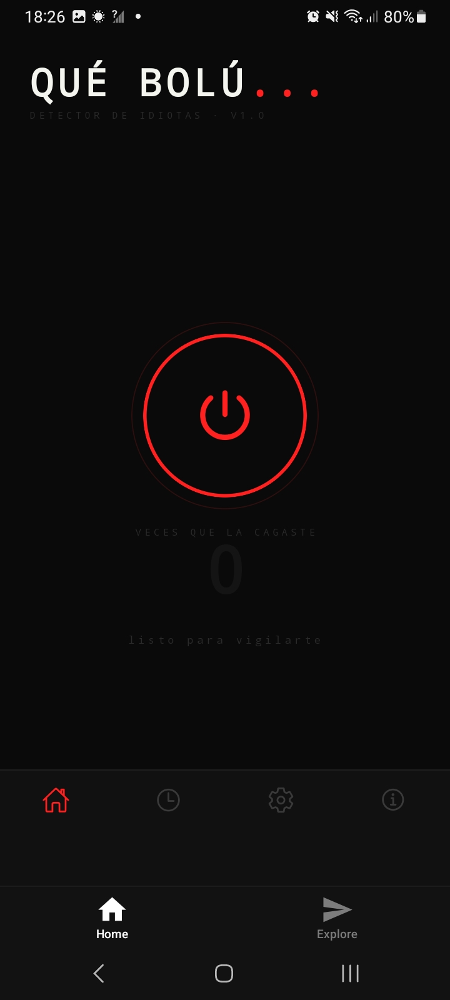
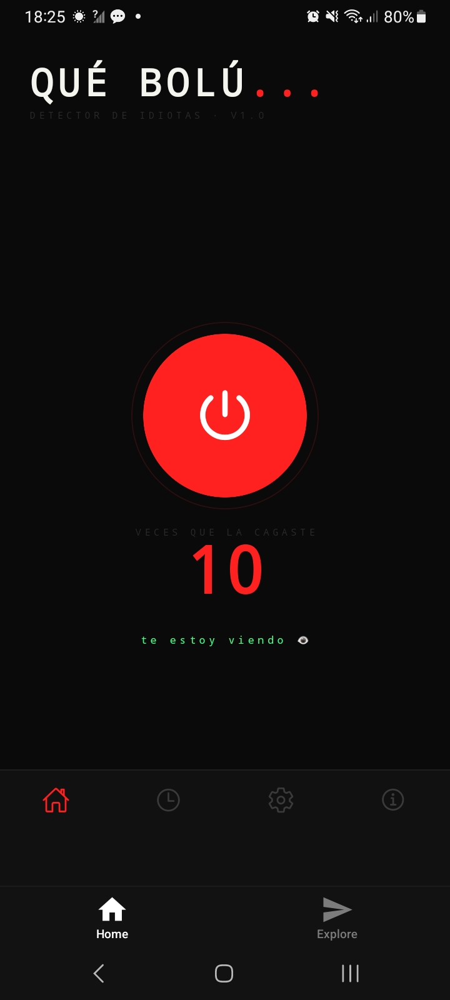
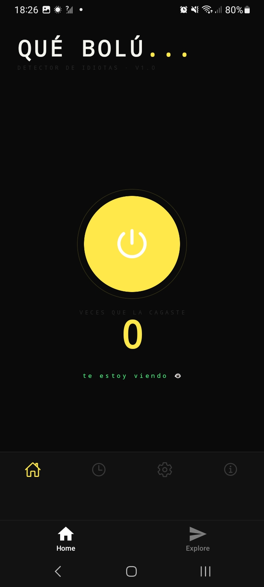
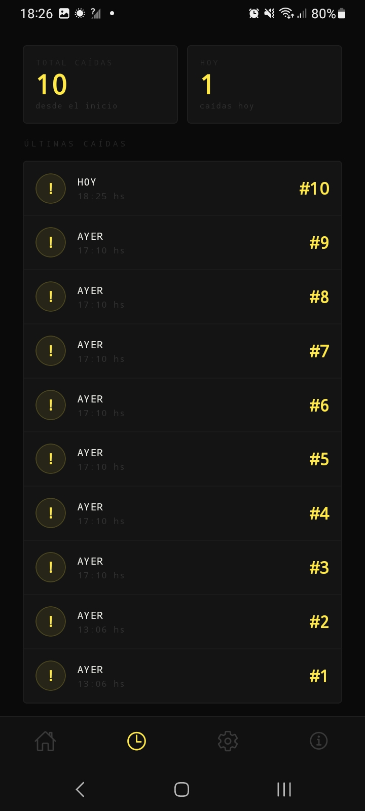

# QUÉ BOLÚ... 📱💥

**DETECTOR DE IDIOTAS · V1.0**

App Android que detecta cuando tirás el celular y reproduce el Wilhelm Scream.
Porque alguien tenía que decírtelo.

---

## ¿Qué hace?

- Detecta caídas del celular usando el acelerómetro
- Reproduce el **Wilhelm Scream** automáticamente al detectar una caída
- Caídas más largas activan el **Tom Scream** como bonus
- Muestra frases sarcásticas en cada caída
- Registra el historial de caídas con fecha y hora
- Contador de "veces que la cagaste"

---

## Screenshots

| Home (inactivo) | Activo | Caída detectada | Historial | Sobre la app |
|---|---|---|---|---|
|  |  |  |  |  |

---

## Tecnologías

- [React Native](https://reactnative.dev/) + [Expo](https://expo.dev/)
- TypeScript
- `expo-sensors` — acelerómetro para detección de caídas
- `expo-audio` — reproducción de audio
- `AsyncStorage` — persistencia del historial
- `expo-router` — navegación por tabs

---

## Estado del proyecto

🚧 En desarrollo activo — próximamente en Google Play Store.

---

## Autor

**Daniel Penayo** · [LinkedIn](https://www.linkedin.com/in/daniel-penayo-a4616a2b8/)
